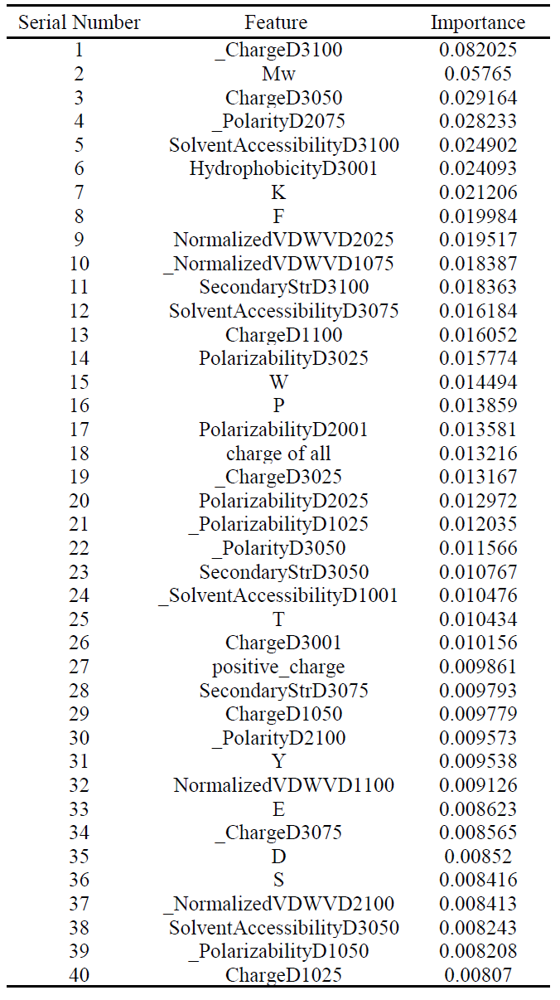

  

## Ⅰ. Data Collection

### Positive Antimicrobial Peptides:

**Dataset source：** APD、DADP、DRAMP、DBAASP、YADAMP

**Filter Criteria:** Specific to Streptococcus mutans

**Steps:** 

- select the samples that are specific to streptococcus mutans
- Remove 7 duplicate sample sequences
- Remove 5 samples with MIC greater than 500
- Remove 1 sample sequence with imprecise MIC values

**Results:**

206 positive Antimicrobial Peptides

### Negative Antimicrobial Peptides:

**Dataset source：**AntiBP2

**Filter Criteria:** Not possessing antibacterial properties

**Step:**

- select the samples without antibacterial properties
- Remove 0 duplicate sample sequences
- Remove 5 samples that do not contain common amino acid sequences

**Results：**

994 negative Antimicrobial Peptides

### **Construction:**  

Anti-S. Mutans Peptides（ASP） Dataset 

## Ⅱ. Data Processing

**Objective：** 

- Eliminating the phenomenon of homologous bias

- Calculating  physicochemical descriptors

- Balancing the ASP Dataset 

**Calculating  physicochemical descriptors:**

​	This part can be divided into three steps：

- Basic physicochemical descriptors calculation
- Amino acid composition calculation (single peptide and dipeptide)
- CTD sequence derivation calculation

Feature calculation table(part)

**Features：** 578 

**Significant Feature ：** MIC（Minimum Inhibitory Concentration） **(./data/ASP.csv)**

## Ⅲ. Mann-Whitney U test

**Objective:**

Filtering negative and positive samples **without significant differences** in specific features

**Approach:**

our experiment dataset has these characteristics as blow:

- non-normal distribution
- small sample size

The best way to test the two sample/group is Mann-Whitney U test

Mann-Whitney U test result are as follows:

**Results:**

ASP dataset after filtering statistically irrelevant features **(./result/ASP_filtering.csv)**

## Ⅳ. Feature Extraction

**Objective:**

gather features that play crucial role in the MIC value of antimicrobial peptides

#### **Method_1： Random Forest**

**steps:**

- Select the columns "LABEL" from the ASP dataset as y variable
- Drop the columns "SEQUENCE"，“MIC” and "LABEL" from the ASP dataset as X  variable
- Separate the variable X and y as X_train,y_train,X_test,y_test
- Balance X_train and y_train by applying Borderline-SMOTE
- Use Random Forest model to select the feature and calculate the importance of features
- Extract features with an importance greater than N times the average, and use the RF model for feature extraction
- Based on the accuracy of local optima, optimize the parameter N
- Save extracted features and corresponding importance values

**Evaluating indicator：**

|              | Accuracy | Precision | Recall | AUC  |
| ------------ | -------- | --------- | ------ | ---- |
| **Test set** | 0.97     | 0.95      | 0.94   | 0.99 |
| Train set    | 1.00     | 1.00      | 1.00   | 1.00 |

**Final Selected Features：**

#### **Method_2： XGboost**

**steps:**

- Select the columns "LABEL" from the ASP dataset as y variable
- Drop the columns "SEQUENCE"，“MIC” and "LABEL" from the ASP dataset as X  variable
- Separate the variable X and y as X_train,y_train,X_test,y_test
- Balance X_train and y_train by applying Borderline-SMOTE
- Use XGBoost model to select the feature and calculate the importance of features
- Using Bayesian optimization for training set parameter tuning
- Extract features with an importance greater than N times the average, and use the RF model for feature extraction
- Based on the accuracy of local optima, optimize the parameter N
- Save extracted features and corresponding importance values

**Evaluating indicator：**

|              | Accuracy | Precision | Recall | AUC  |
| ------------ | -------- | --------- | ------ | ---- |
| **Test set** | 0.98     | 0.96      | 0.95   | 0.99 |
| Train set    | 1.00     | 1.00      | 1.00   | 1.00 |

#### **Method_3： Neural Network**

**steps:**

- Select the columns "LABEL" from the ASP dataset as y variable
- Drop the columns "SEQUENCE"，“MIC” and "LABEL" from the ASP dataset as X  variable
- Separate the variable X and y as X_train,y_train,X_test,y_test
- Balance X_train and y_train by applying Borderline-SMOTE
- create a deep learning model of neural network with linear, RELU,Linear,RELU,Linear,Sigmod structure
- train the neural network model and make a feature classification prediction
- use AHSP library to evaluate the feature importance
- Save extracted features and corresponding importance values

**Evaluating indicator：**

|              | Accuracy | Precision | Recall | AUC  |
| ------------ | -------- | --------- | ------ | ---- |
| **Test set** | 0.96     | 0.83      | 0.92   | 0.99 |
| Train set    | 1.00     | 1.00      | 1.00   | 1.00 |

## Ⅴ. Regression prediction

**Objective:**

Using the features extracted in the previous step, perform regression fitting using MIC as the indicator to obtain the relationship between MIC and the indicator

#### Method_1： Regression of Random Forest

**steps:**

- obtain the selected features and Corresponding original ASP dataset as X variable
- standardized the X variable data by applying Standard_Scaler
- Select the columns "MIC" from the ASP dataset as y variable
- Perform logarithmic transformation on the MIC indicator represented by variable y to achieve linear fitting
- Separate the variable X and y as X_train,y_train,X_test,y_test
- Use Linear Regression model to fitting the MIC indicator
- Map the results of MIC to the 0-1 interval using an improved softmax function and provide a box plot
- save the regression evaluating metrics and figures

**Evaluating indicator：**

|                   | R squared error | Squared Error | Mean Absolute Error |
| ----------------- | --------------- | ------------- | ------------------- |
| **Random Forest** | 0.58979         | 2.14157       | 1.04971             |

#### Method_2：Regression of XGBoost 

**steps:**

- obtain the selected features and Corresponding original ASP dataset as X variable
- standardized the X variable data by applying Standard_Scaler
- Select the columns "MIC" from the ASP dataset as y variable
- Perform logarithmic transformation on the MIC indicator represented by variable y to achieve linear fitting
- Separate the variable X and y as X_train,y_train,X_test,y_test
- Use Linear Regression model to fitting the MIC indicator
- Map the results of MIC to the 0-1 interval using an improved softmax function and provide a box plot
- save the regression evaluating metrics and figures

**Evaluating indicator：**

|                   | R squared error | Squared Error | Mean Absolute Error |
| ----------------- | --------------- | ------------- | ------------------- |
| **Random Forest** | 0.5807          | 2.1890        | 1.0927              |

#### Method_3： Nerual Network

**steps:**

- obtain the selected features and Corresponding original ASP dataset as X variable
- standardized the X variable data by applying Standard_Scaler
- Select the columns "MIC" from the ASP dataset as y variable
- Perform logarithmic transformation on the MIC indicator represented by variable y to achieve linear fitting
- Separate the variable X and y as X_train,y_train,X_test,y_test
- Use Linear Regression model to fitting the MIC indicator
- Map the results of MIC to the 0-1 interval using an improved softmax function and provide a box plot
- save the regression evaluating metrics and figures

**Evaluating indicator：**

|                   | R squared error | Squared Error | Mean Absolute Error |
| ----------------- | --------------- | ------------- | ------------------- |
| **Random Forest** | 0.5807          | 2.1890        | 1.0927              |

